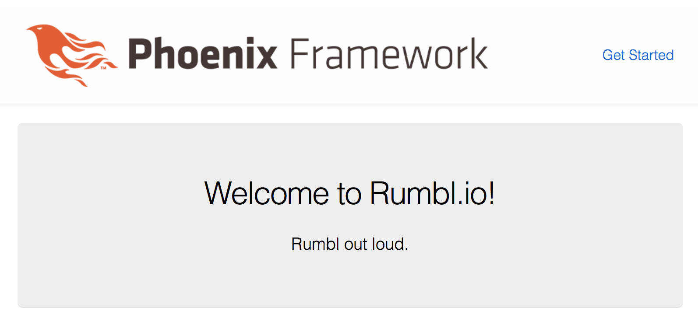
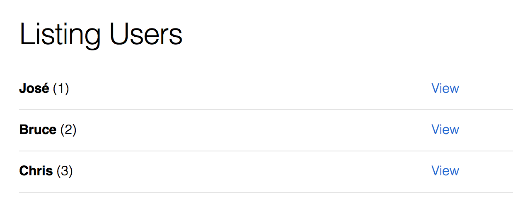

# Project Description

## 1. Creating the Project

```
$ mix phx.new rumbl
$ cd rumbl
$ mix ecto.create
$ mix phx.server
```
to make sure it’s working, and point your browser to
http://localhost:4000/

## 2. A Simple Home Page

Make your lib/rumbl_web/templates/page/index.html.eex look like this:

```html
<section class="phx-hero">
  <h1><%= gettext "Welcome to %{name}!", name: "Rumbl.io" %></h1>
  <p>Rumbl out loud.</p>
</section>
```
Now we have a home page started. Notice that your browser has already changed as shown in the figure below.



## 3. Working with Contexts
We’ll need a data structure for representing
a user,
so create a new file in lib/rumbl/accounts/user.ex and key this in:

```elixir
defmodule Rumbl.Accounts.User do
  defstruct [:id, :name, :username]
end
```

### Elixir Structs
A
struct is Elixir’s main abstraction for working with structured data.

elixir maps:
```elixir
iex> alias Rumbl.Accounts.User

iex> user = %{usernmae: "jose"}
%{usernmae: "jose"}

iex> user.username
** (KeyError) key :username not found in: %{usernmae: "jose"}
```

elixir structs:
```elixir
iex> jose = %User{name: "Jose Valim"}
%Rumbl.Accounts.User{id: nil, name: "Jose Valim", username: nil}

iex> jose.name
"Jose Valim"
```
Now, if we misspell a key, we’re protected:
```elixir
iex> chris = %User{nmae: "chris"}
** (KeyError) key :nmae not found in:
%Rumbl.Accounts.User{id: nil, name: nil, username: nil}
```
A struct is a map that has
a `__struct__` key:
```elixir
iex> jose.__struct__
Rumbl.Accounts.User
```
With our user in place, let’s define our Accounts context. We will add a couple
of functions which will allow user account fetching. Let’s create a new file in
lib/rumbl/accounts.ex and key this in:
```elixir
defmodule Rumbl.Accounts do
  @moduledoc """
  The Accounts context.
  """

  alias Rumbl.Accounts.User

  def list_users do
    [
      %User{id: "1", name: "José", username: "josevalim"},
      %User{id: "2", name: "Bruce", username: "redrapids"},
      %User{id: "3", name: "Chris", username: "chrismccord"}
    ]
  end

  def get_user(id) do
    Enum.find(list_users(), fn map -> map.id == id end)
  end

  def get_user_by(params) do
    Enum.find(list_users(), fn map ->
      Enum.all?(params, fn {key, val} -> Map.get(map, key) == val end)
    end)
  end
end
```
Let’s take the context for a spin. Start the console with iex -S mix . The -S mix
option starts IEx in the context of the Mix script, giving us access to all
modules in our application directly in IEx:

```elixir
iex> alias Rumbl.Accounts
iex> alias Rumbl.Accounts.User
iex> Accounts.list_users()
[
%Rumbl.Accounts.User{
id: "1",
name: "José",
username: "josevalim"
},
%Rumbl.Accounts.User{
id: "2",
name: "Bruce",
username: "redrapids"
},
%Rumbl.Accounts.User{
id: "3",
name: "Chris",
username: "chrismccord"
}
]
iex> Accounts.get_user("1")
%Rumbl.Accounts.User{
id: "1",
name: "José",
username: "josevalim"
}
iex> Accounts.get_user_by(name: "Bruce")
%Rumbl.Accounts.User{
id: "2",
name: "Bruce",
username: "redrapids"
}
```
## 4. Building a Controller

Specifically, we need two routes. UserController.index
will show a list of users, and UserController.show will show a single user. As
always, create the routes in rumbl/lib/rumbl_web/router.ex :
```elixir
scope "/", RumblWeb do
  pipe_through :browser
  get "/users", UserController, :index
  get "/users/:id", UserController, :show
  get "/", PageController, :index
end
```
Let’s take a closer look at the :index route:
```elixir
get "/users", UserController, :index
```

Let’s create a controller in lib/rumbl_web/controllers/user_controller.ex . Initially, we’ll
include one function called index to find the users from our Accounts context:
```elixir
defmodule RumblWeb.UserController do
  use RumblWeb, :controller
  alias Rumbl.Accounts
  def index(conn, _params) do
    users = Accounts.list_users()
    render(conn, "index.html", users: users)
  end
end
```
## 5. Coding Views

Let’s build a view in lib/rumbl_web/views/user_view.ex :

```elixir
defmodule RumblWeb.UserView do
  use RumblWeb, :view
  alias Rumbl.Accounts
  def first_name(%Accounts.User{name: name}) do
    name
    |> String.split(" ")
    |> Enum.at(0)
  end
end
```
Next, in lib/rumbl_web/templates , we created a user directory and
a new index template in lib/rumbl_web/templates/user/index.html.eex :
```elixir
<h1>Listing Users</h1>
<table>
  <%= for user <- @users do %>
    <tr>
      <td><b><%= first_name(user) %></b> (<%= user.id %>)</td>
      <td><%= link "View", to: Routes.user_path(@conn, :show, user.id) %></td>
    </tr>
  <% end %>
</table>
```

## 6. Using Helpers

That link function packs a surprising amount of punch into a small package.
Phoenix helpers provide a convenient way to drop common HTML structures
onto your view.

```Elixir
$ iex -S mix
iex> Phoenix.HTML.Link.link("Home", to: "/")
{:safe, [60, "a", [[32, "href", 61, 34, "/", 34]],
62, "Home", 60,
47, "a", 62]}
```
Let’s convert this result into a human-
readable form by calling Phoenix.HTML.safe_to_string/1 :

```Elixir
iex> Phoenix.HTML.Link.link("Home", to: "/") |> Phoenix.HTML.safe_to_string()
"<a href=\"/\">Home</a>"
```
We use a path that’s automatically created for our
:show route to specify the link target. Now you can see that our list has the
three users we fetched from our repository as shown in the figure



Open up lib/rumbl_web.ex to see exactly what’s imported into each view:

```Elixir
def view do
  quote do
    use Phoenix.View, root: "lib/rumbl_web/templates",
    namespace: RumblWeb
    # Import convenience functions from controllers
    import Phoenix.Controller,
    only: [get_flash: 1, get_flash: 2, view_module: 1]
    # Use all HTML functionality (forms, tags, etc)
    use Phoenix.HTML
    import RumblWeb.ErrorHelpers
    import RumblWeb.Gettext
    alias RumblWeb.Router.Helpers, as: Routes
  end
end
```

the contents of the view function will be macro-expanded to each and every
view! So remember, in rumbl_web.ex , prefer import statements to defining your
own functions.

## 7. Showing a User

let’s look at the route we created earlier:
```Elixir
get "/users/:id", UserController, :show
```
To show a single user
using this request, we need a controller action, which we add to lib/rumbl_web/con-
trollers/user_controller.ex :
```Elixir
def show(conn, %{"id" => id}) do
  user = Accounts.get_user(id)
  render(conn, "show.html", user: user)
end
```
